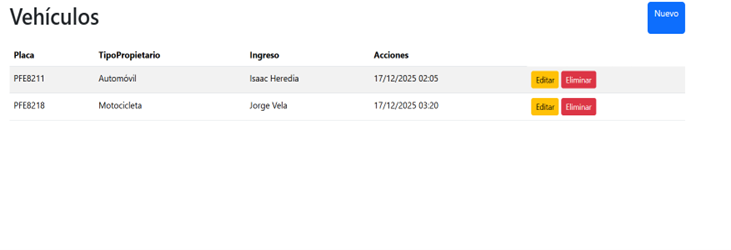
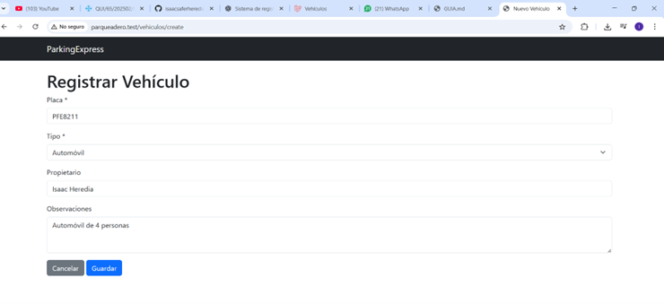
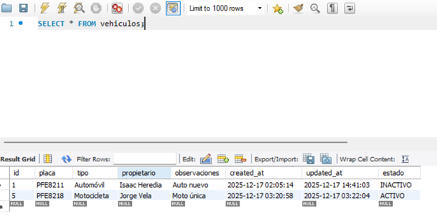
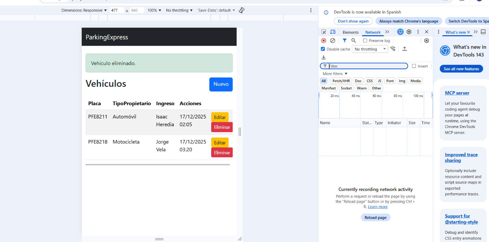

# Tarea – Desarrollo en Plataformas

**Estudiante:** Jonathan Heredia  
**Fecha:** 17/12/2025  
**Paralelo:** 2

---

## Mis Decisiones de Diseño

### 1. Tabla

**Nombre de la tabla:**  
`vehiculos`

**Campos:**

| Campo | Tipo | ¿Obligatorio? |
|---|---|---|
| id | bigint (auto incremental) | Sí |
| placa | varchar(10) | Sí |
| tipo | varchar(20) | Sí |
| propietario | varchar(100) | No |
| observaciones | text | No |
| estado | varchar(10) | Sí |
| created_at | timestamp | Sí |
| updated_at | timestamp | Sí |

---

### 2. Tipos de vehículo
- Automóvil  
- Motocicleta  
- Camioneta  

---

### 3. ¿Se puede eliminar registros?

**Respuesta:**  
No se eliminan físicamente los registros.

**Razón (1 línea):**  
Se aplica borrado lógico mediante el campo `estado`, marcando los registros como INACTIVO para mantener el historial y la trazabilidad de la información.
## 📸 Capturas del Sistema

### Listado de vehículos

### Registro de vehículo

### Vehículo registrado

### Edición de vehículo

### Vehículo actualizado

### Eliminación de vehículo (borrado lógico)

### Vehículo marcado como inactivo

### Borrado lógico en la base de datos

### Vista móvil

